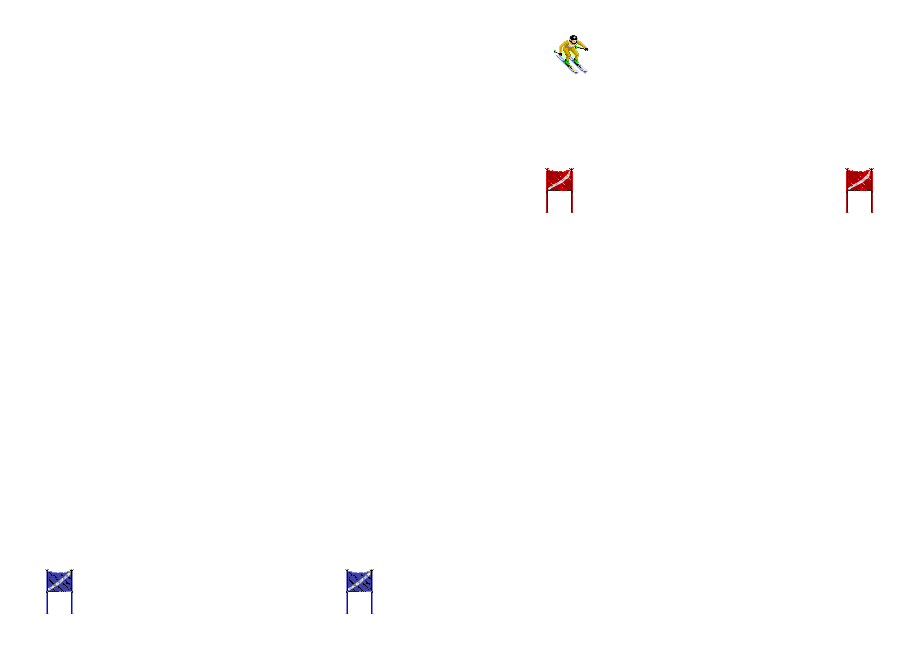

#ski

This is an arcade skiing game. You are a skier competing in the winter 
olympics and must earn pride for your country!

##How to Build

Replace the SFML-2.1 folder with the one your system requires.  You can get
the SFML library at http://www.sfml-dev.org/download/sfml/2.1/.  Copy and
paste your system's required dll files from SFML-2.1\bin into the .exe's
directory (If you aren't sure which ones, the errors will tell you what they
are called). The ones included are for windows x64 with gcc 4.7 or later.
The current Makefile should allow a person with GNU Make, windows x64, and
gcc 4.7 to compile the project as is. TODO: add build options for other
platforms to the Makefile.

##Future Development

The game currently shows a skier that can be controlled as they ski down a
white background with gates. Adding more game features and, less importantly,
fleshing out the graphics (ex. adding more skier and gate sprites) are the main
priorities currently.

##Other Notes

The sprites used for the skiers and gates (and any others you recognize from
images/skiing_sprite_sheet.png) are not created by me, but by Tiertex Design
Studios.
